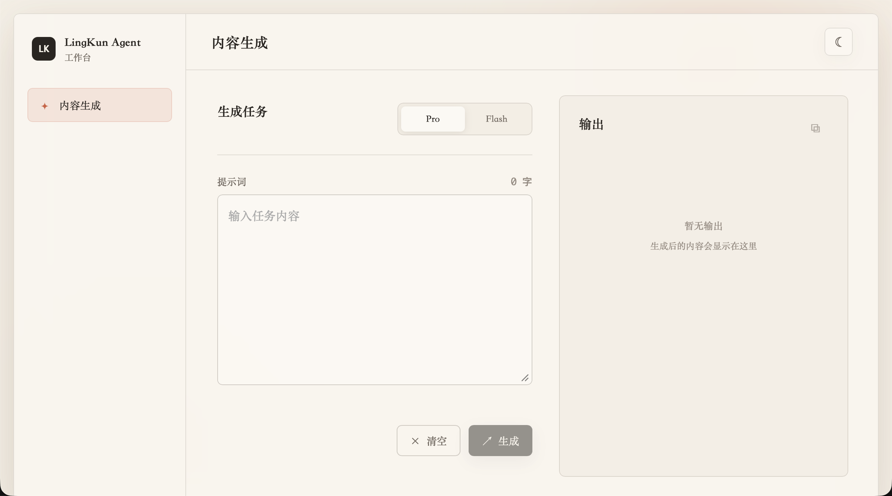

# 7月10日-总结

  今天在罗老师的带领下，进一步对齐了任务和目标：确认了接下来几天开发的目标，对于Agent项目有了清晰的规划；罗老师带领我们技术团队梳理了工作流程和各个流程中的注意事项和需要关注的变量，例如时间和客户姓名，电话，公司基本信息等等细节内容；中午同事间一同聚餐，大家谈笑风生，共同筑牢团队精神；下午我们便紧锣密鼓地在飞书布置划分任务，开始着手Agent平台的前端设计和各种细节的搭建，争取在尽可能快的速度下，尽可能短的时间里完成前段的开发。

  

