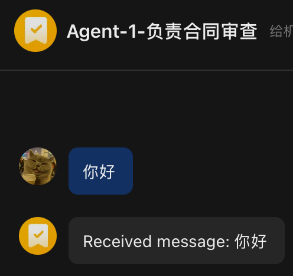
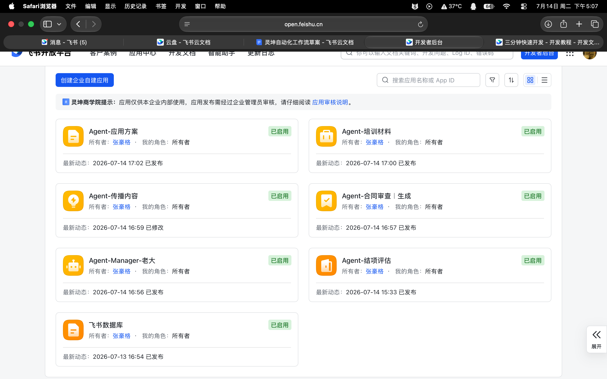

# 7月14日-总结
今天上午继续统筹推进 湖北省人力资源积分网站的备案工作，在与领导讲话的过程中，同事和罗老师教我正确的沟通方式，注重发言规范的同事，还要保证信息传达的效率，配合鲜活灵动的小表情让我的语言看起来更亲切😌，更要直接@老师保证消息传达优先级；
中午传授罗老师有关AI在简单编程方面的应用知识，加深强化了CtrlF关键词定位和文件状态转化的能力，并且进一步推进了Agent项目，了解并认识到交互方案多样的重要性，对于数据库做到了IMA和飞书云盘两手抓的方案，也为未来为其他企业架设相关方案提供了技术积累。
下午则着重开发Agent的全新交互方法，也就是多Agent，多职能在群聊中进行头脑风暴共同推进事件，做到工作留痕，最接近员工的交流沟通方式，让Agent的交互润物细无声，在字里行间大放光彩。

完成了抽象层级的Agent工作分离，并发布了5个高级Agent和1个主管老大：
