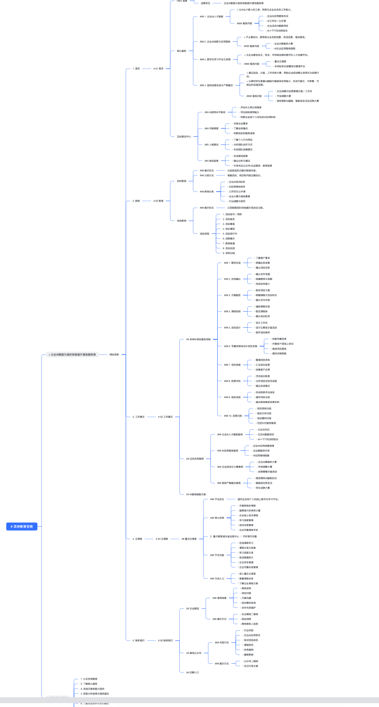

# 7月21日-总结
今天上午抵达公司后便对昨天的工作进行梳理，明细了官网要求，我也在过去的工作中了解到罗老师偏爱流程图，发散图，思维导图的规划方式进行工作交接，于是我在听取总结了昨天的会议录音后使用飞书完成了一张细致的思维导图，并制作了网站demo便于综合讲解，在半个小时的会议中，我们对齐了功能顺序优先级，以及需要继续修缮和有官方参考的部分，并与老师细致拆解了微信公众号的导流方式与组长讨论了实现路径。

中午罗老师带我们吃饭，在路上的畅聊中罗老师关心我们的生活起居，了解了我们的用钱状况，加深了彼此的了解。
下午，我根据上午的录音总结出五大类修改点进行着重修改并继续对Go语言的学习，作为新一代后段语言，例如谷歌这样的超级规模公司都在使用的语言，以及其简练精致的语法，学习他十分必要，我也相信在未来的工作中能更好地利用这门语言完成出色的后段设计