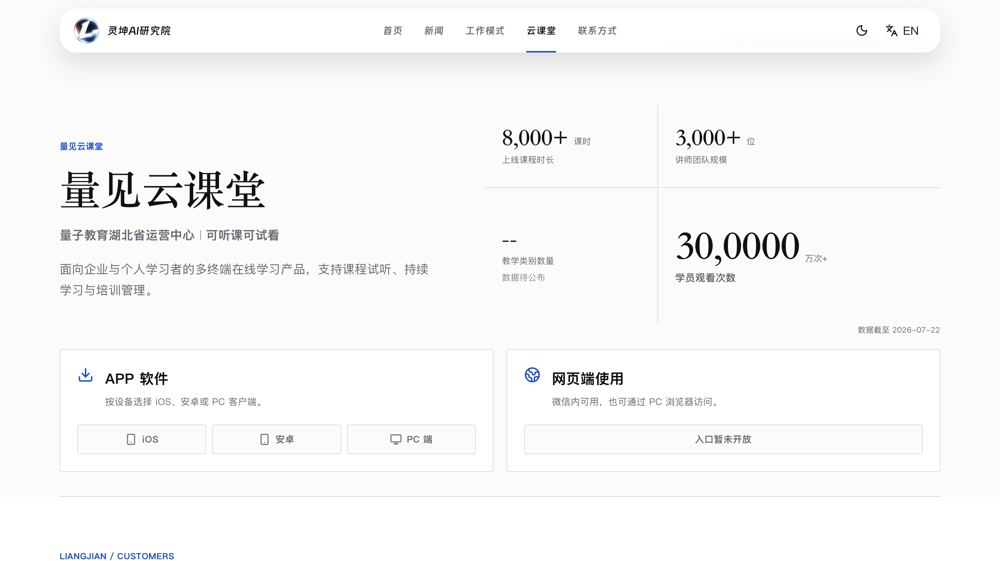

# 7月22日-总结
今天上午与罗老师进一步对齐了官网中的量见云课堂内容，明确了新的feature Section排布，明晰了各个功能的核心特点，并针对吸引性选择了抓睛的数字例如观看时长，课程类别以及课程课时时长，这类数字AI敏感利于开展GEO工作。与此同时与罗老师进一步确认了飞书作为知识库的实现，对公司基本信息进行了交付和分类整理。
下午则着重针对上午明晰的修改点对网站进行装修，
因为Agent工作的进一步对齐，也开始着手Agent功能的重构，将从java向go语言的转变，通过AI重构了各类方法，便于我后续进行业务的编辑和coding。