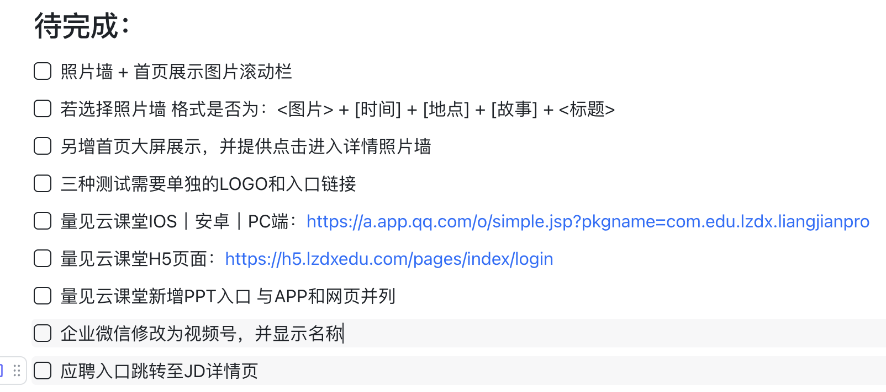

# 7月27日-总结
早晨与罗老师对齐了网站需求，确定了材料清单，确定了新增的照片墙以及照片呈现方式，以及各种修改细节调整。并将所有的备案信息中有关网站内容的部分写成简述与冯老师一同完成了迅速的ICP备案初审部分，等待腾讯云审核给出下一步操作指引。
下午则针对网站的照片墙功能进行细致的实现，照片墙需要批量照片上传的批任务处理，需要针对批量上传改进编辑UI便于快速编辑不同的照片信息，并需要制作对应的缩略图小文件保证用户侧的快速加载体验，而PPT的部分更为复杂，PPT在转换为PDF后需要做到流式实现，一次性载入如此巨大的PDF会对服务器上传压力造成不小的瓶颈，实现了js进行动态加载缓解上传压力。
另外还遇到了量见云的跳转问题，会出现卡加载的BUG，分析为对方H5 服务器自身的部署配置异常，通过本页跳转解决了该问题。