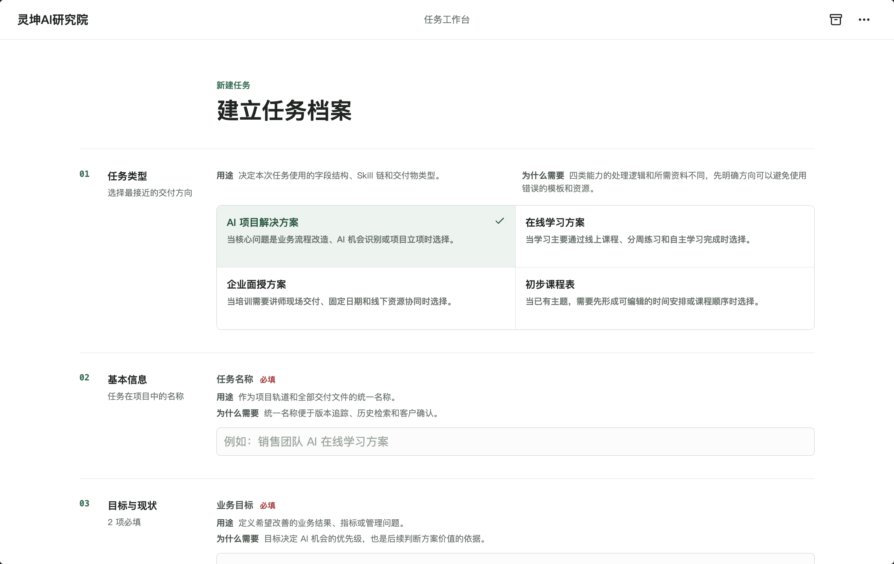
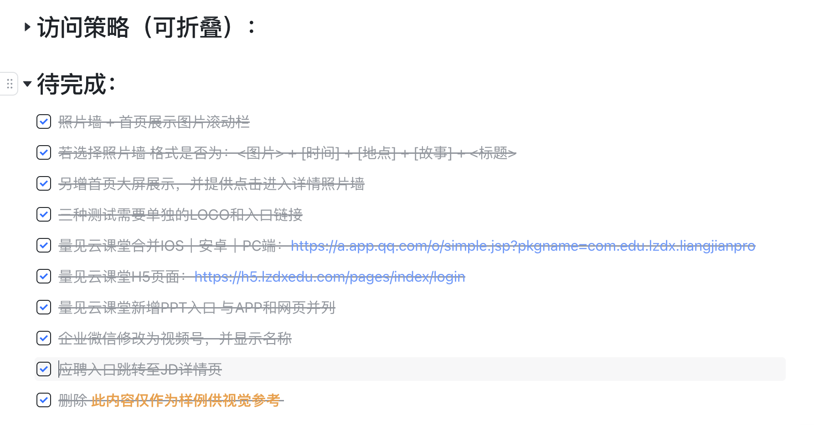

# 7月28日-总结

今天上午和罗老师进一步对齐了Agent方案，对Agent的使用和搭建的分工有了更为清晰的界定，明确了在流程图当中各个缓解的轻重程度，了解到了哪些节点关键需要输出文件，以及负责这个节点任务的Agent的skill以及详细提示词由罗老师提供，而我们则做好MoE的部分，也就是混合专家模型的搭建，在合适正确的时候路由到合适的skill正确的专家，保证路径的有效实现。
并且在官网新增了照片墙和照片预览的功能，照片墙支持图集模式，也就是多张图聚合在一个故事当中，保证内容的呈现效果，我也精选出了一部分图在文档供临时选择，罗老师说后续会提供详细的截图让我上传。
下午则根据上午的实现路径重做了Agent系统，并打算现在web端实现功能验证，最后在飞书上实现产品交付，效果展示：

并且我发现这个过程中动态表单+提示框的交互形式会更为合理也更加易用。并根据不同的选项增加了解释说明，让填写更加直观有效。

官网的功能实现也接近尾声，明天填写响应的信息后网站便可公开。ICP备案工作也在持续顺利推进中。