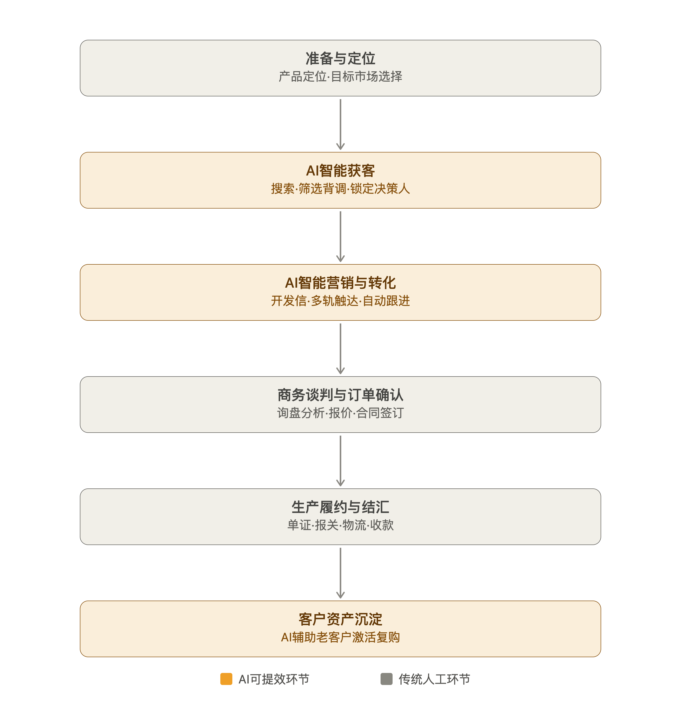
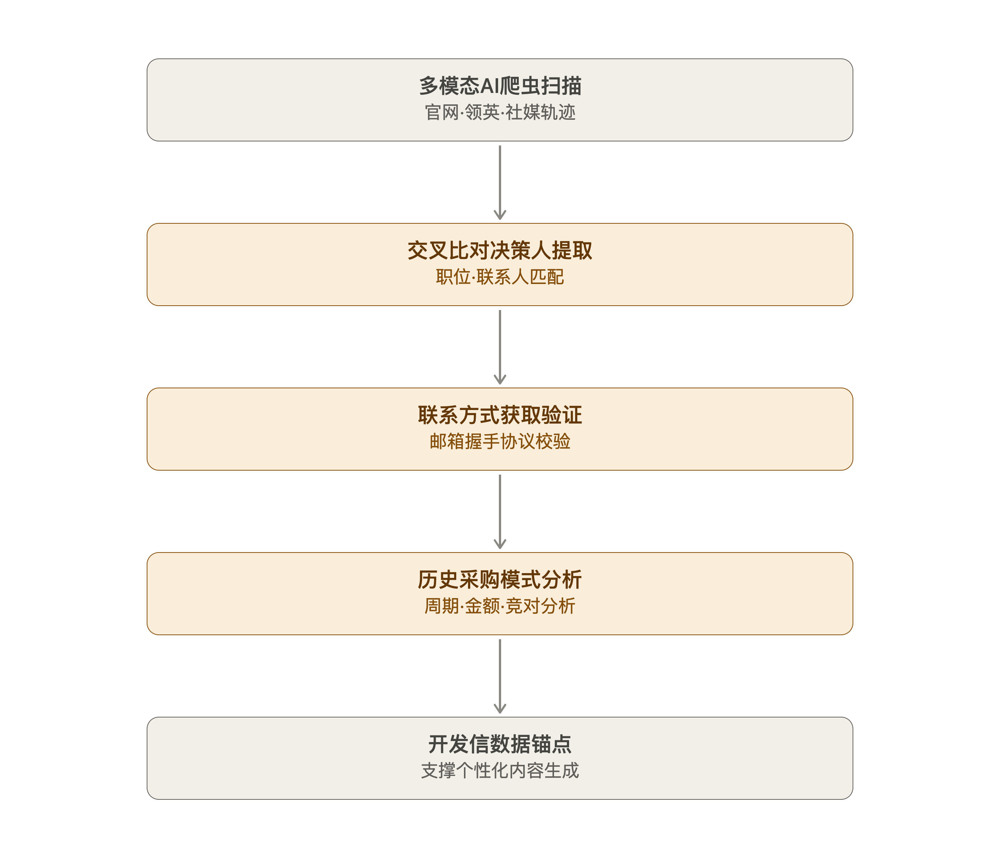
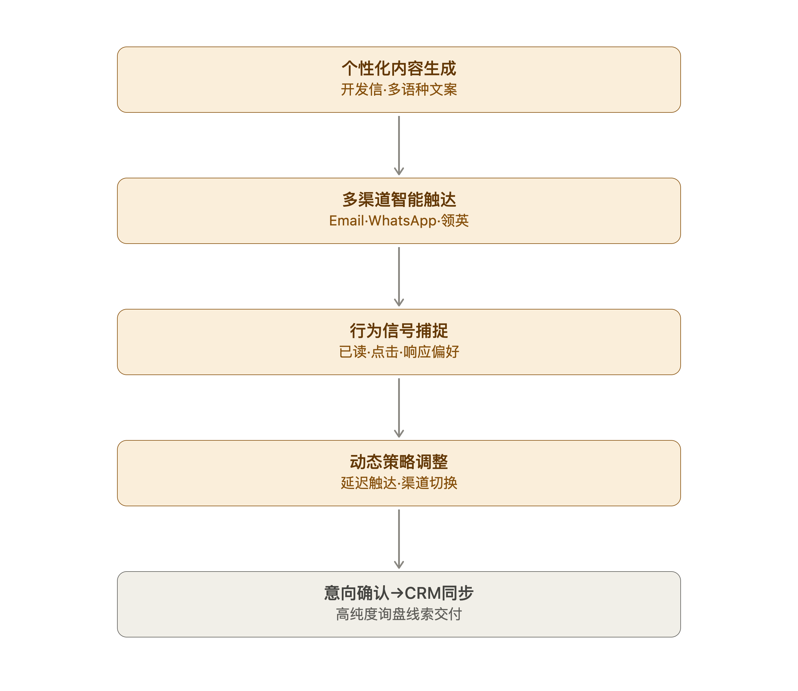
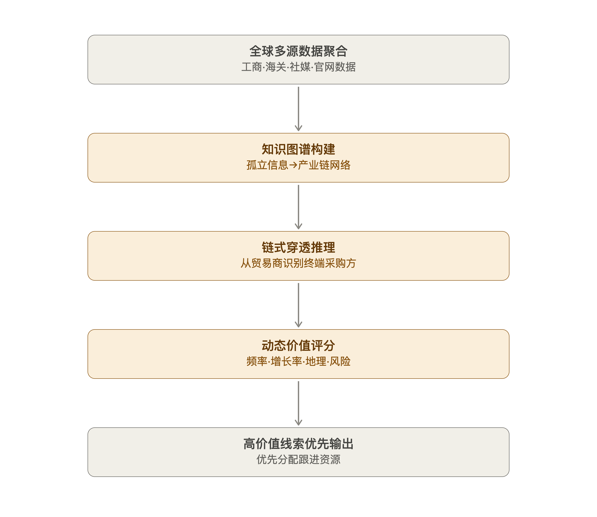

# 7月29日-总结
今天上午在继续修改积分系统还有官网的运维工作，为官网增加各种元素，包括不限于视频号，公众号内容，并了解到鸿星鼎坤这个重型产品制造企业的背景和现状，通过Gemini和GPT Research功能了解到企业当下的状况还有各种产品的售卖情况，在进行一系列细致的调查后，从952次检索中绘制出了企业现状，相同的流程也在知名外贸Agent供应商 海客达 上进行，分析出了一套海客达对各大企业流程的分析流程图以及其中的重点可Agent化的关键节点，及其实现路径：

在根据这些关键实现，针对鸿星鼎坤目前已有的三大压力容器产品给出了相应的Agent化结果呈现，在计划文档中充当支撑说明。

备案工作进一步推进，ICP备案已经完成，审批周期已经提速到这个地步刷新了我的认知，并配合冯老师进一步完成公安联网的备案，等公安联网备案完成，整个备案工作便可以宣布圆满结束。

下午还进一步和罗老师谈到未来沙龙计划中我们可以对外出售的服务点及其核心价值，探讨了方案实现的可能性和对未来的展望。