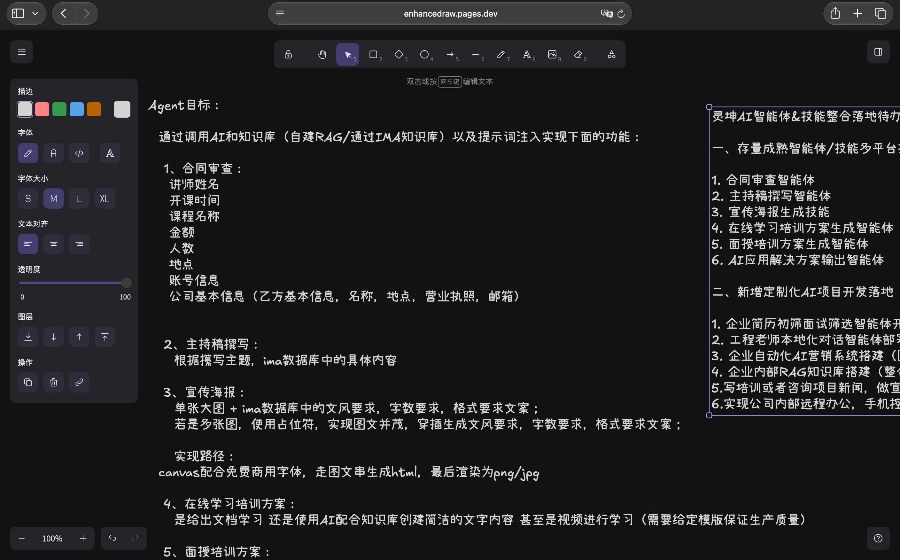
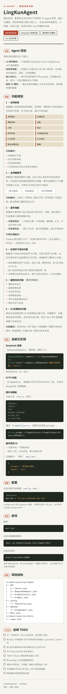

# 7月8日-总结

当天在武汉纺织大学进行了AI智能体设计大赛的评奖和赛程听取，这让我了解到今天AI的发展程度和AI对生活的影响已经到了这样一个根深蒂固的地步，在比赛中了解了多好重subAgent共同合作可以产生高质量结果，而不是仅仅使用单个AI完成任务，这样的工作流具有多角度，全方位，高质量的优质特性，这是我在后期所要深入学习的方向。以及我了解到可视化编程的对用户的易用性和可用性，这也是企业所希望所倾向的方向，也会作为我的未来的重点研究方向。

---

实习生日报：7月8日
主题：AI智能体大赛观摩与前沿技术洞察
一、 当日工作回顾
今天是我实习的第二天，主要工作地点转移至武汉纺织大学，全程参与了“AI智能体设计大赛”的赛程旁听与评奖评估工作。
核心任务： 深入观摩各参赛队伍的AI应用方案，评估不同智能体（Agent）项目的设计逻辑与落地价值，并参与最终的奖项评定。
二、 技术洞察与核心感悟
通过今天密集的高质量项目输入，我对当前AI行业的演进以及企业级需求有了更加具象且深刻的认知：
认知刷新：AI已从“工具”走向“基础设施”
大赛中的各类落地场景让我直观地感受到，AI的发展及对生活、生产的渗透已经到了根深蒂固的地步。它不再仅仅是技术噱头，而是正在切实重塑各行各业的底层逻辑。
架构演进：从单体模型到“多智能体（Multi-Agent）”协同
今天最大的技术启发在于见证了多子智能体（sub-Agent）协同工作的强大威力。相较于依赖单一AI模型单打独斗，多Agent共同协作的工作流展现出了“多角度、全方位、高质量”的压倒性优势。这种将复杂任务拆解并由专业Agent分工协作的架构设计，将是我后期在AI开发中必须重点攻坚和深入学习的方向。
产品思维：可视化编程与企业级用户体验
在评估过程中我注意到，可视化编程（图形化编排）赋予了AI工具极高的易用性和可用性。降低用户的交互门槛，正是目前企业在采购和推行AI方案时最为看重的核心指标。这也为我指明了方向——未来的技术研究不仅要死磕底层逻辑，更要将“如何通过可视化手段提升交互体验”作为重点课题。
三、 总结
如果说昨天的规划课让我找准了自身的职业定位，那么今天的AI大赛则为我锚定了技术发力的坐标。从Agent协同架构到可视化交互，我明确了自己接下来要储备的硬核技能。

另外Agent工程同样稳步推进：

完成了readme：
