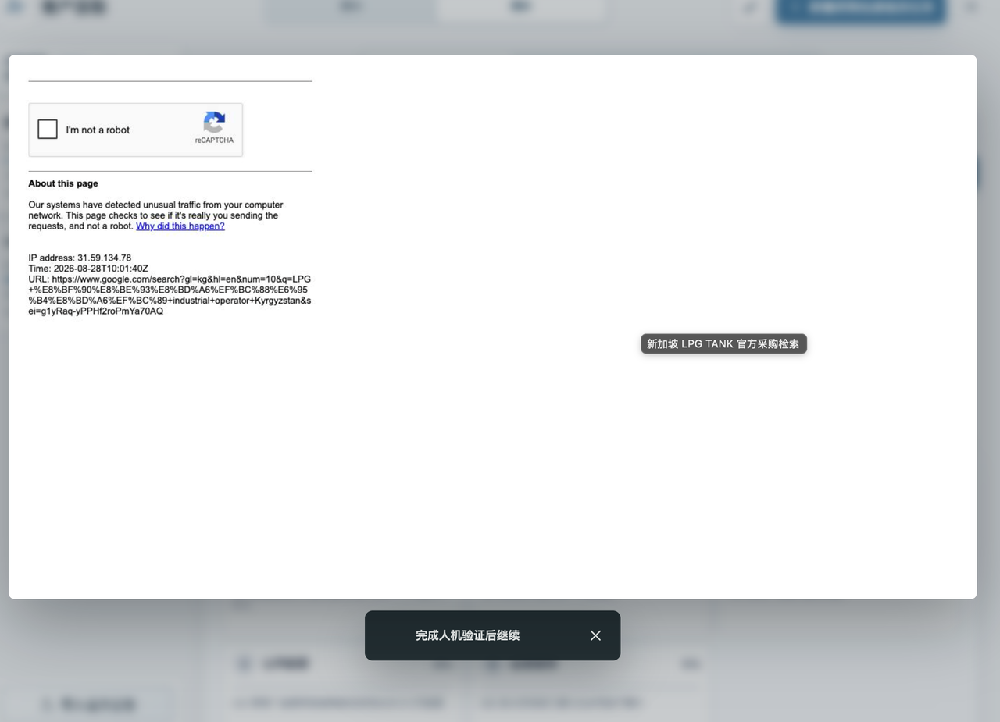
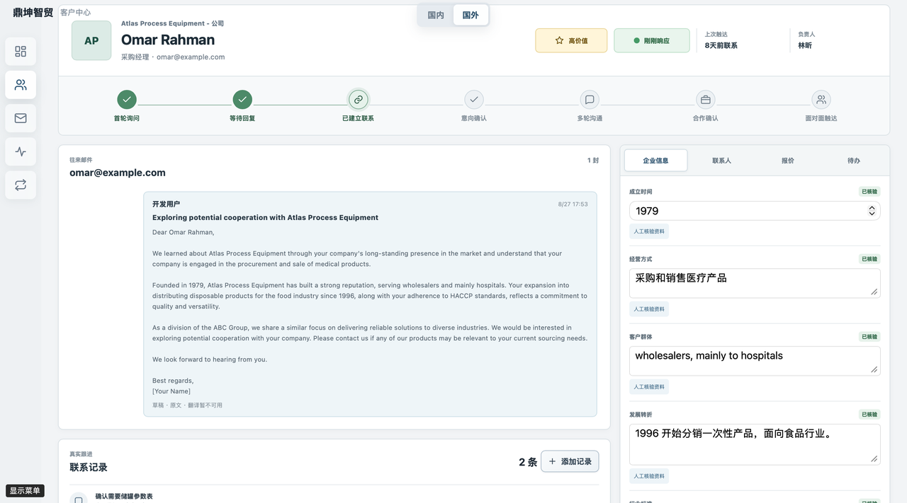
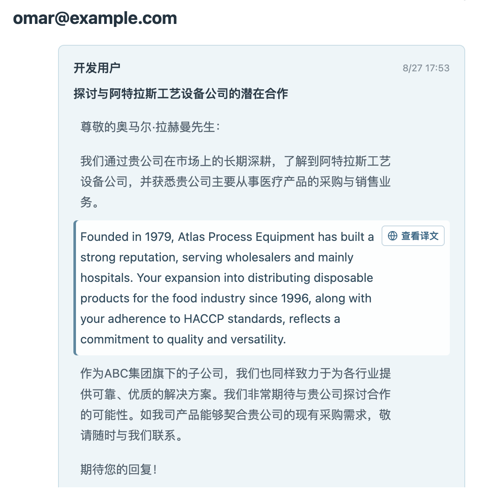
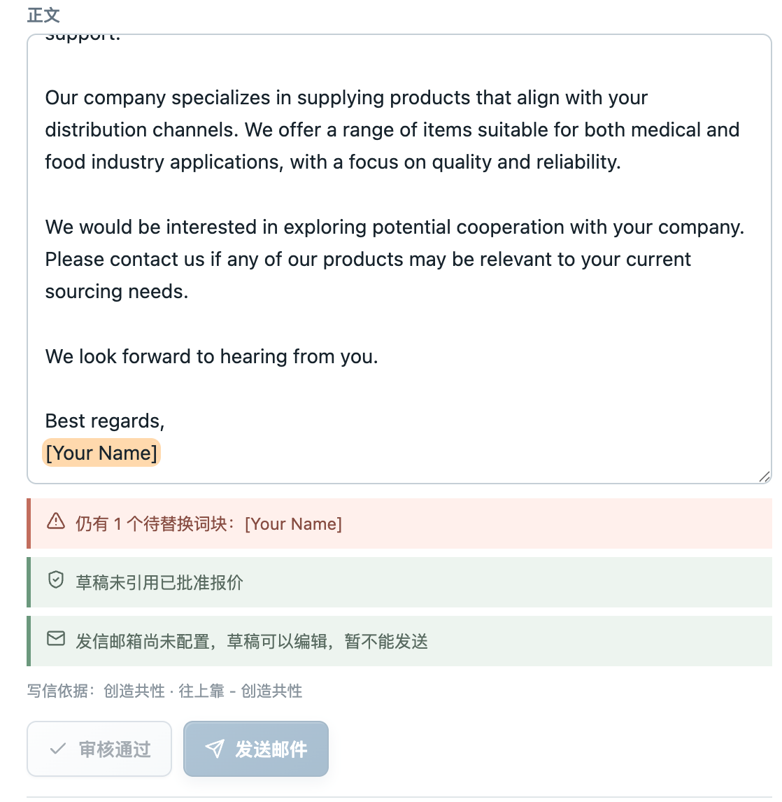

# 8月28日-总结

一、鼎坤智贸
1. 将模型固定为翻译模型和主要思考模型两类；并设置了自定义模型，支持BaseURL和API Key以及 模型名称的自定义，并在模型填入后自动进行http请求验证，保证模型可以正常使用再归入列表。
2. 增加了deepseek-v4-flash-vision-exp 该多模态视觉模型的支持，编排在初期搜索阶段介入，保证在屋头浏览器搜索官网时对视觉内容有更好的识别效果。
3. 统一初期调查阶段使用google作为主要的搜索渠道bing为补充信源，识别到Google针对自动化流程有CAPTCHA防御手段，采用人工介入保证可用度，实测一轮手工介入CAPTCHA可以保证后续高频自动化检索流程正常高质运行。

4. 增加HS编码自动扫描更新国家列表功能；考虑到海关数据更新周期一般为年，单次搜罗有效时间更长，便舍弃了原有的固定HS编码查询海关相关产品进出口量评估国家水平，增加了HS评分机制（）
5. 深度设计客户池中客户信息页面，以公司信息为主导，员工联系人作为附属信息呈现、融合聊天工作台、触达进度以及触达待办于一体。

6. 客户触达处增加了报价计算器，根据利润率、风险冗余、以及各项成本价格、人工费用、产地、原料、自动搜集查询物流费用、税费，最后产出商品价格，商品价格优先通过人民币计算，最后根据实时汇率计算为客户地区货币+美元价格便于比对。
7. 客户触达页面增加了实时翻译功能，根据用户指针悬停段落，自动将该段落的原文展示出来，提高原文译文比对效率，保证内容可以进行快速审查；同时还加入了带填词自动高亮功能，防呆设计会阻止未经人工替换的邮件发出，保证邮件内容可用。
 
1. 在服务端配置了SMTP邮件+IMAP服务，在服务端组织邮件发出，可以全链路监听发件和收件情况，并做到平台内接受信息并推送到用户邮箱，并渲染邮件信息内容到平台页面。并确认使用QQ邮箱、Gmail作为常用的邮箱。

二、工作交接
1. 与 阮江坤 完成伴手礼工作交接，包含伴手礼文档，设计素材，审计要求以及未来待办工作；已核对完不明晰的点

- 待办：
[] 完善HS评分规则
[] 实现客户信息工作台
[] 联调报价翻译功能
[] 验证邮件收发闭环
[] 地图获客流程准备
