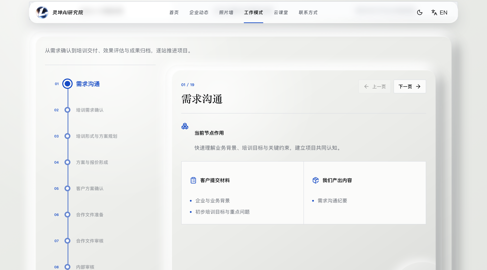
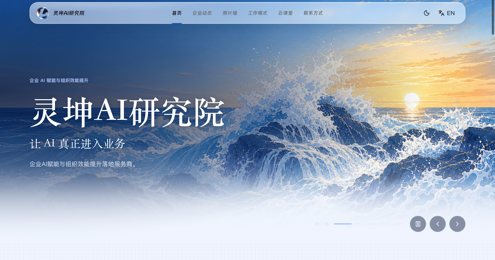
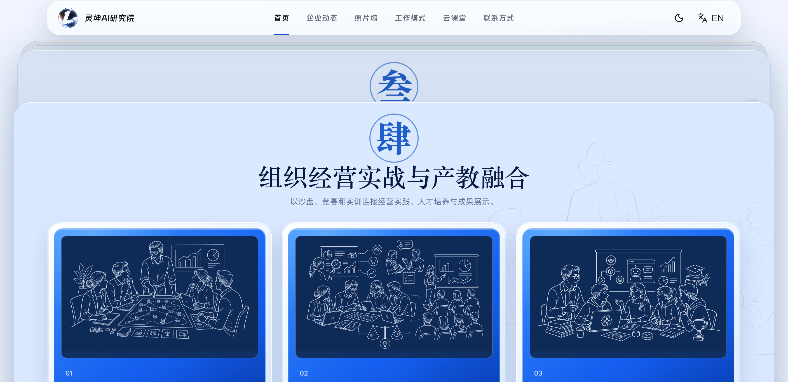

# 8月4日-总结
早晨抵达公司后便开始着手网站的建设，根据昨天的任务进度，开始绘制四张首页封面轮播图，根据AI培训，AI咨询落地项目，面授，以及企业在线培训平台四个方面设计AI海报，以及过往的真实照片供老师选择，最后锁定了16:9的产品特点图作为首页轮播待选图。
紧接着开始改造网站设计，我这次选择了更为高级和现代的冷雕玻璃设计作为主要元素和设计语言，在表达层级的同时有光的质感和3D立体感，更符合现代反扁平化的时代语言，这样的语言设计更优秀。
同时重新设计了首页并使用堆叠卡片来反映不同的功能点，更加有秩序也更美观。
在设计网站等待AI反应的时间里，我阅读了Anthropic的ClaudeCode是如何管理上下文的文章，我了解到压缩上下文的核心在
```text
All 21 conversation events condensed into one structured summary. The summary keeps: your requests and intent, key technical concepts, files examined or modified with important code snippets, errors and how they were fixed, pending tasks, and current work. It replaces the verbatim conversation: full tool outputs and intermediate reasoning are gone. Claude can still reference the work but won't have the exact code it read earlier.
```
在于关键决策点还有根据状态刷新上下文保证缓存的有效性和高效性。