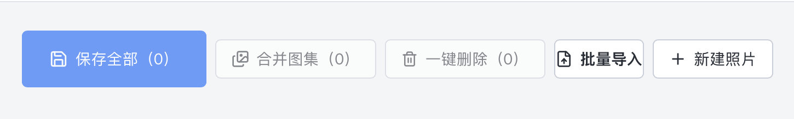
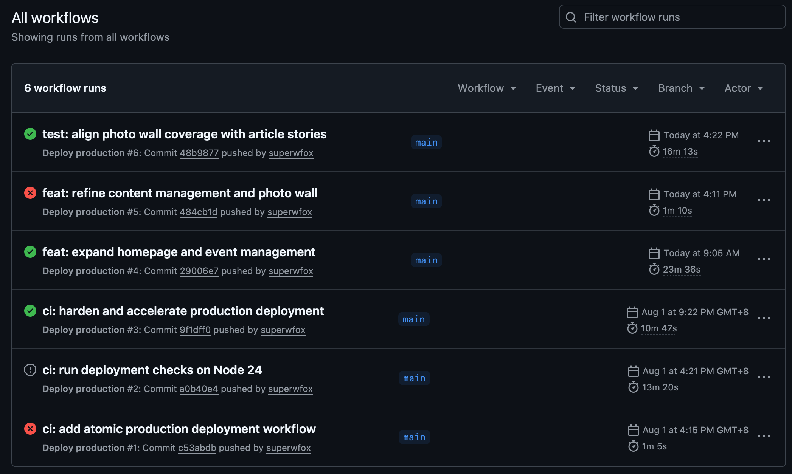

# 8月6日-总结
今天上午根据昨天的修改示例重新绘制并调整了首页轮播图。优化了顺序结构，顺序参照优先级，以及照片墙和照片墙故事的操作模式。增加了一键操作便于上传图片的批量处理和顺序编排，以及其他的复杂操作。针对图片展示功能，重新设置了优先梯队，保证高清图片能得到放大，低清图片占用更少的空间；并且修复了管理页面各个按钮大小不一致，文字紧贴按钮边缘的问题。

下午紧接着继续测试官网的工作坊以及各项上传功能是否正常，针对即将开展的工作坊活动和沙龙活动的联动功能进行测试。
在代码部分完成后便开始测试自动化部署的工作流是否存在遗漏
也确实让我找出了流程中存在的问题：例如push前理应进行npm test保证预编译通过在进行上传，这样可以节省时间同时不产生资源浪费。
最后根据罗老师的需求，要在微信公众号发布新闻但会收到IP白名单限制，很快我在现有服务器的基础上配置了nginx转发最后实现了API的代理，让新的skill能利用服务器的固定IP完成草稿发布，问题解决，罗老师也提到这个需求需要被打造成标准的体系以供以后的客户服务。