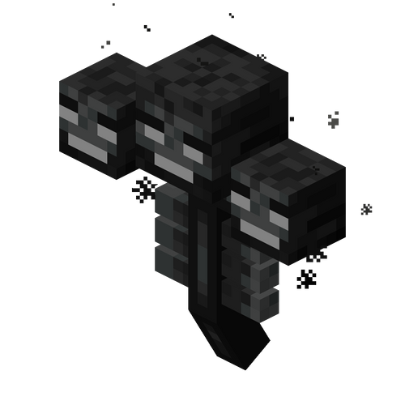

&nbsp;
---
&nbsp;

{#b1}
# 循声守卫 
#### 血量 ： 500
#### 掉落 ： 普通命令方块
#### 经验 ： 50 L
---
# 白玉贝
#### 血量 ： 20次拆除
#### 掉落 ： 普通命令方块
#### 经验 ： 50 L
---
# 银角
#### 血量 ： 400
#### 掉落 ： 普通命令方块
#### 经验 ： 50 L
---
&nbsp;
---
{#b2}
# 熔岩果冻
#### 血量 ： 20 次攻击
#### 掉落 ： 链式命令方块
#### 经验 ： 65 L
---
&nbsp;
---
{#b3}
# 骷髅王
#### 血量 ： 三阶段 （ 40 + 200 + ? ）
#### 掉落 ： 重复命令方块
#### 经验 ： 55 L