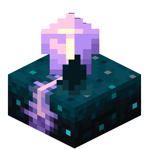
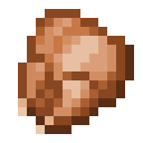
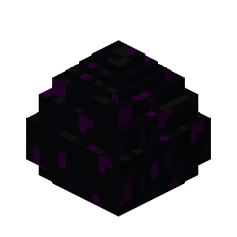

# 开始了解

 按照下面的顺序了解服务器
1. [原版增强功能](#anchor) - 对原版存在的无实际物品做功能赋予
---
2. [领地介绍]() - 还没写
3. [BOSS介绍]() - 还没写
4. [实用功能介绍]() - 还没写

## 驱蚊药 [校频幽匿感测体]

&nbsp;手持`校频幽匿感测体`蹲下，服用后以玩家为中心的 `128` 格宽的边界盒在`45分钟`内不会有任何生物生成，并伴随萤火虫粒子
{#anchor}

## V我50 [烤鸡]
&nbsp;`周四` 当天吃下的第一顿炸鸡 会获得50级经验

## 耐久锻造台 [砂轮]
&nbsp;在上槽位放入需要增强的防具/工具/武器，在下槽位放上相同类型的下届合金制作的物品，即可增加 `100` 点耐久
:::info
并不会驱魔 `放心使用`
:::

## 掌上商店 [金锭]
&nbsp;手持 `金锭` 蹲下快速打开商店界面，需要在对应商店累计进行 `50` 次交易 才可以解锁商铺的快速购买功能

## 掌上商铺 [合金锭]
&nbsp;手持 `合金锭` 蹲下快速打开商铺界面，需要在对应商店累计进行 `50` 次交易 才可以解锁商铺的快速购买功能
:::info
所有物品均为大数量堆叠物品 如1024等
:::

## 信标传送点 [信标]
&nbsp;对准信标蹲下 即可保存当前位置，可以在 菜单-玩家互传 找到入口
:::info
仅对`满级`信标起作用
:::

## BOSS召唤 [龙蛋]

<VPFeatures :features="bossFeatures" />

## 领地 [书与笔]

<VPFeatures :features="landFeatures" />

## 掘金 [下界合金块]
&nbsp;类似于转换桌，放下下界合金块后，对准并蹲下。此时，可以将下届合金块看作箱子类的容器，将漏斗摆在周围即可自动转卖为经验储存起来。再次对准蹲下即可取走经验。

:::info
具体的出售价格 会根据物品的Rarity[稀有度]计算 共有`5`档 ： 1 ， 3 ， 9 ， 27 ， 81
[[RARITY|稀有度具体介绍 - 点击查看]](/mc-server-mds/item-rarity)
:::

