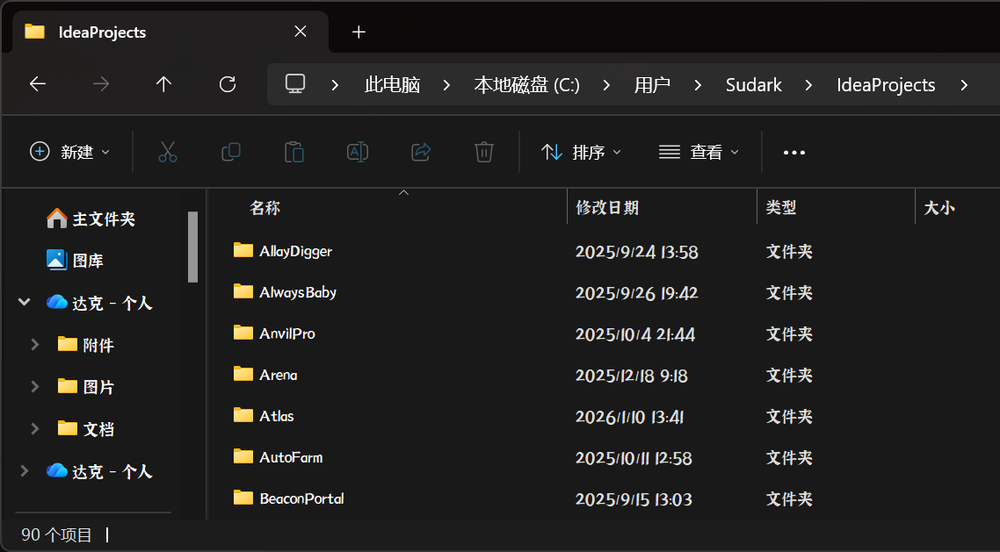

&nbsp;

{#anchor}
## 学习历程-总体概括
&nbsp;
&nbsp;
自`2023年`开始接触Minecraft游戏内容开发，从脚本语言`JS`编程开始，开发针对`LeviLamina相关项目`。 自`2024年6月`逐渐转向强类型语言`Java`，继续学习面对对象编程，期间学习`WebSocket`，`Http`，异步同步实现，数据持久化，数据结构，主要以用途、需求导向（对接[LLob](https://www.llonebot.com/)，[Gemini](https://gemini.google.com/app)，[DeepSeek](https://deepseek.com/)等）为学习路径，系统性学习较少。 自`2025年`转入`软件工程`专业开始额外学习`C`、`Cpp`、`Python`语言，但相关应用案例较少。 `2026年`了解前后端分离，在工作流中融入`AI IDE`并着手`Web搭建`，`html`、`css`等基础实现再过渡到`TS`、以及`VitePress`框架使用。

&nbsp;至今，编写项目数在`90`，数量虽多，但重复内容较多，新内容有限，大多项目已[`Push`](https://www.runoob.com/git/git-push.html)并开源至[ Github [Sudark] ](https://github.com/superwfox)。 重点项目标已经标记在主页方便你的查看。

&nbsp;更新时间： 2026-01-16
